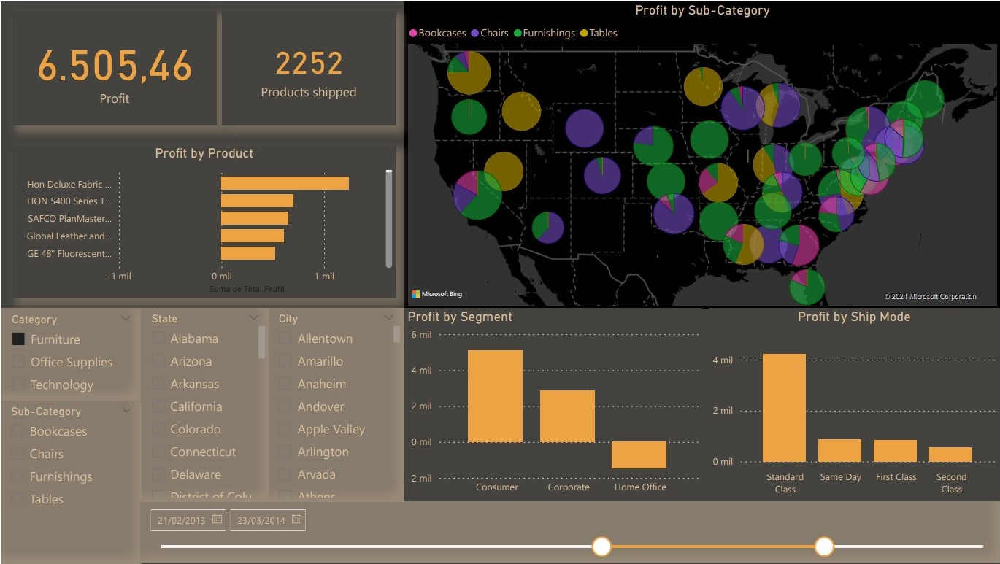

Dashboard created from a company´s sales dataset from Kaggle

We can find: 

-Total profit

-Total number of shipped items

-Profit by segment and by shipping mode

-Profit by product order top to bottom by profit

Filter by Time ,Demographics (State and City) , Category and subcategory of the products.

